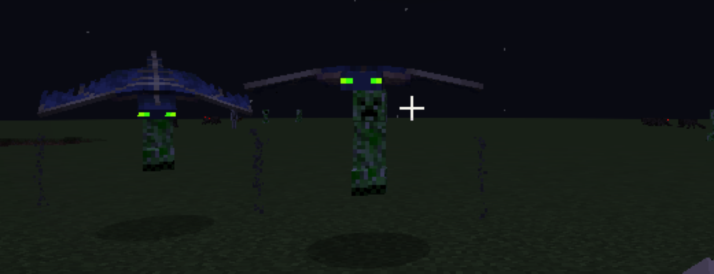

# 幻翼苦力怕 Phantom Creeper

一个 Minecraft Java 版 **1.20.4** 的 **Fabric** Mod：一只下面吊着苦力怕的幻翼，入夜后从玩家头顶出现，锁定玩家俯冲，贴脸自爆。



> English: A phantom carrying a creeper. It spawns 15–25 blocks above players (no insomnia required), locks on, dives and explodes within 6 blocks. Spawn count, interval and daytime spawning are configurable via game rules. See [Game rules](#游戏规则).

## 特性

- **外观**：上半截是幻翼，下半截吊着一只苦力怕。俯冲时苦力怕保持竖直下垂，还会轻轻摆动
- **刷新**：不需要失眠条件。玩家头顶露天时，每隔一段时间在玩家上方 15～25 格内生成
- **攻击**：锁定 64 格内看得到的玩家 → 尖啸俯冲 → 进入 6 格点燃引信（0.5 秒，会膨胀闪白）→ 爆炸，威力与苦力怕相同
- **放弃**：玩家躲进室内，连续 5 秒看不到就解除锁定，回到空中盘旋
- **连锁引爆**：同一批生成的幻翼苦力怕互相炸不死；其中一只爆炸时，同批的其余成员不论在哪都会**立刻全部引爆**
- **室内生成（可选）**：默认玩家在室内/洞穴里不会刷新；开启游戏规则后会直接生成在玩家所在的室内空间
- **怕阳光**：白天会像幻翼一样被晒着火（开启白天刷新时除外）
- **破坏方块**：受 `mobGriefing` 游戏规则控制
- **掉落**：火药 0～2；被玩家击杀时额外掉幻翼膜 0～1（均受抢夺加成）
- **刷怪蛋**：在创造模式物品栏的“刷怪蛋”页
- **语言**：简体中文、English

## 安装

### 前置

| 需要 | 版本 |
|---|---|
| Minecraft | Java 版 1.20.4 |
| [Fabric Loader](https://fabricmc.net/use/) | 0.15.0 或更高 |
| [Fabric API](https://modrinth.com/mod/fabric-api/versions?g=1.20.4) | 1.20.4 对应版本（如 0.97.3+1.20.4） |

### 步骤

1. 到 [Releases](https://github.com/Lightly20110815/phantom-creeper/releases) 下载最新的 `phantom-creeper-x.x.x.jar`
2. 把它和 Fabric API 一起放进 `mods` 文件夹：
   - **官方启动器 / 未开启版本隔离**：`.minecraft/mods/`
   - **HMCL / PCL 等开启了版本隔离的启动器**：`.minecraft/versions/<版本名>/mods/`
     （HMCL 也可以在“版本设置 → 模组管理”里直接把 jar 拖进去）
3. 启动 **1.20.4 Fabric** 版本

**多人服务器**：服务端和每个客户端都需要安装本 Mod 和 Fabric API。

## 快速体验

进入一个**非和平难度**的世界，打开聊天框输入：

```mcfunction
/time set midnight
/gamerule phantomCreeperSpawnInterval 5
```

站在露天处，几秒后幻翼苦力怕就会在头顶出现并俯冲过来。

> 创造模式下它们不会攻击你（和原版怪物一样），想被炸就切回生存模式：`/gamemode survival`

也可以直接召唤：

```mcfunction
/summon phantomcreeper:phantom_creeper ~ ~20 ~
```

## 游戏规则

所有规则都可以用 `/gamerule` 修改，也可以在创建世界时的“更多世界选项 → 游戏规则”界面里修改（“生物生成”分类下）。

| 游戏规则 | 默认值 | 取值范围 | 说明 |
|---|---|---|---|
| `doPhantomCreeperSpawning` | `true` | true / false | 是否自然生成幻翼苦力怕 |
| `doPhantomCreeperDaytimeSpawning` | `false` | true / false | 白天是否也生成。开启时幻翼苦力怕**不会被阳光烧着** |
| `doPhantomCreeperIndoorSpawning` | `false` | true / false | 玩家在室内（头顶看不到天空，含建筑和洞穴）时是否也生成。关闭时不刷；开启时直接生成在玩家所在的室内空间 |
| `phantomCreeperSpawnCount` | `1` | 1 ～ 64 | 每次刷新时，在**每名玩家**附近生成的数量（露天时在上方 15～25 格，室内时在同一空间内） |
| `phantomCreeperSpawnInterval` | `60` | 1 ～ 3600 | 两次刷新之间的间隔（秒）。调小后立即生效 |

示例：

```mcfunction
# 每 30 秒刷一次，每次 3 只
/gamerule phantomCreeperSpawnInterval 30
/gamerule phantomCreeperSpawnCount 3

# 白天也刷
/gamerule doPhantomCreeperDaytimeSpawning true

# 躲在屋里也会刷进屋里
/gamerule doPhantomCreeperIndoorSpawning true

# 关闭自然生成（刷怪蛋和 /summon 仍然可用）
/gamerule doPhantomCreeperSpawning false

# 爆炸不破坏方块（原版规则，同时影响其他生物）
/gamerule mobGriefing false
```

### 刷新条件

每次到达刷新间隔时，对每名玩家依次检查：

1. 世界是**主世界**，难度**不是和平**，`doMobSpawning` 与 `doPhantomCreeperSpawning` 都为 `true`
2. 天色够暗（夜晚或雷暴天）；若开启了 `doPhantomCreeperDaytimeSpawning` 则忽略此条
3. 玩家不是旁观模式

然后按玩家所处位置生成 `phantomCreeperSpawnCount` 只：

- **露天**（头顶能看到天空）：在玩家上方 15～25 格、水平 ±10 格内的空位生成
- **室内**（头顶看不到天空，包括建筑和洞穴）：
  - `doPhantomCreeperIndoorSpawning` 为 `false`（默认）：不生成
  - 为 `true`：在玩家周围水平 ±8 格、距离玩家至少 3 格、**玩家能直接看到**的室内空位生成（不会刷进隔壁房间或地下的封闭空洞）。室内空间小，生成后往往很快就会进入 6 格引爆范围，非常危险

### 连锁引爆

每次刷新时，给同一名玩家生成的那一批幻翼苦力怕属于同一个编组：

- 同组成员的爆炸**炸不死**彼此
- 任何一只爆炸时，同组其余成员**不论距离多远、引信是否点燃，全部立刻引爆**
- 不同批次、刷怪蛋或 `/summon` 召唤的不受影响（会被正常炸伤）

也可以用 NBT 手动编组，例如召唤两只同组的：

```mcfunction
/summon phantomcreeper:phantom_creeper ~ ~10 ~ {SpawnGroup:[I;1,2,3,4]}
/summon phantomcreeper:phantom_creeper ~5 ~10 ~ {SpawnGroup:[I;1,2,3,4]}
```

## 可调参数

以下数值目前需要改代码后重新构建，位于 [`PhantomCreeperEntity.java`](src/main/java/com/syyann/phantomcreeper/entity/PhantomCreeperEntity.java) 和 [`PhantomCreeperSpawner.java`](src/main/java/com/syyann/phantomcreeper/PhantomCreeperSpawner.java) 开头：

| 常量 | 默认 | 含义 |
|---|---|---|
| `TRIGGER_RADIUS` | 6.0 | 距离玩家多少格以内点燃引信 |
| `FUSE_TIME` | 10 | 引信时长（tick，20 tick = 1 秒） |
| `EXPLOSION_POWER` | 3.0 | 爆炸威力（苦力怕为 3，闪电苦力怕为 6） |
| `LOCK_ON_RANGE` | 64.0 | 锁定玩家的最大距离 |
| `DIVE_SPEED` / `CIRCLE_SPEED` | 0.85 / 0.45 | 俯冲 / 盘旋速度 |
| `MIN_SPAWN_HEIGHT` / `MAX_SPAWN_HEIGHT` | 15 / 25 | 生成高度（玩家上方多少格） |

## 从源码构建

需要 **JDK 21**（Gradle 会自动寻找本机已安装的 JDK 21，不要求它是系统默认 Java）。

```bash
git clone https://github.com/Lightly20110815/phantom-creeper.git
cd phantom-creeper
./gradlew build          # 产物在 build/libs/phantom-creeper-x.x.x.jar
./gradlew runClient      # 启动带本 Mod 的开发版客户端
./gradlew runServer      # 启动开发版服务端
```

如果提示 `Unable to download toolchain matching the requirements`，说明 Gradle 没找到你的 JDK 21（例如 Homebrew 的 `openjdk@21` 是 keg-only，不在默认搜索路径里）。在 `~/.gradle/gradle.properties` 里加一行指向它即可：

```properties
org.gradle.java.installations.paths=/usr/local/opt/openjdk@21/libexec/openjdk.jdk/Contents/Home
```

### 项目结构

```
src/main/java/com/syyann/phantomcreeper/
├── PhantomCreeperMod.java          # 入口
├── ModEntities.java                # 实体注册（碰撞箱 0.9 × 1.6）
├── ModItems.java                   # 刷怪蛋
├── ModGameRules.java               # 游戏规则
├── PhantomCreeperSpawner.java      # 自然刷新
└── entity/PhantomCreeperEntity.java  # AI：锁定、俯冲、盘旋、引信、爆炸
src/client/java/com/syyann/phantomcreeper/client/
├── PhantomCreeperRenderer.java         # 基于原版幻翼渲染器，抬高模型、闪白
└── HangingCreeperFeatureRenderer.java  # 在下方渲染吊着的苦力怕
```

模型和贴图直接复用原版幻翼与苦力怕的资源，Mod 本身不包含任何贴图文件。

## 许可证

[MIT](LICENSE)
